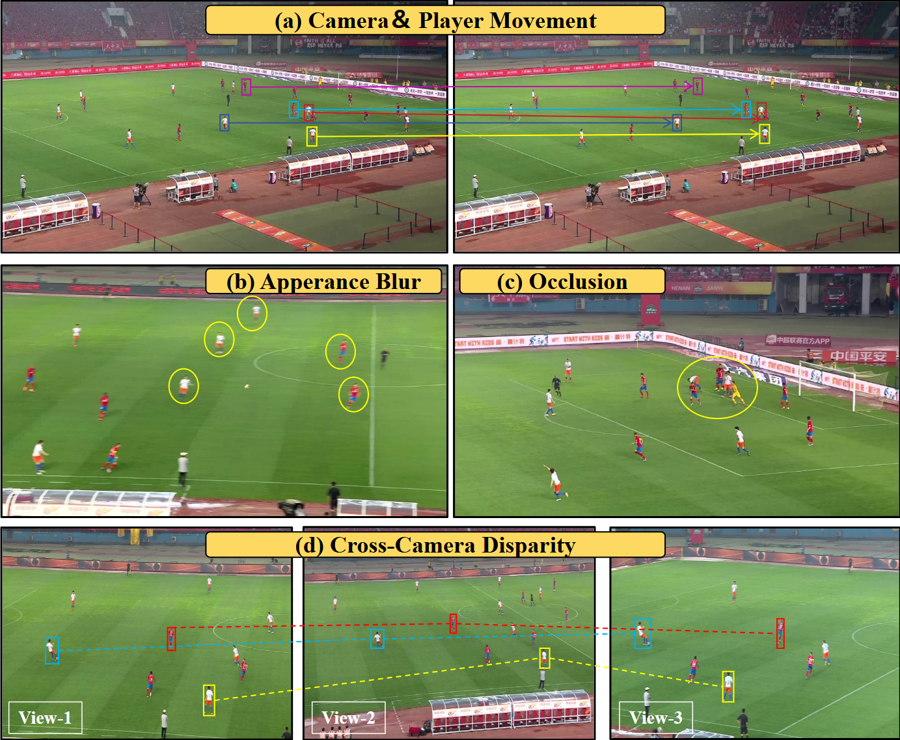
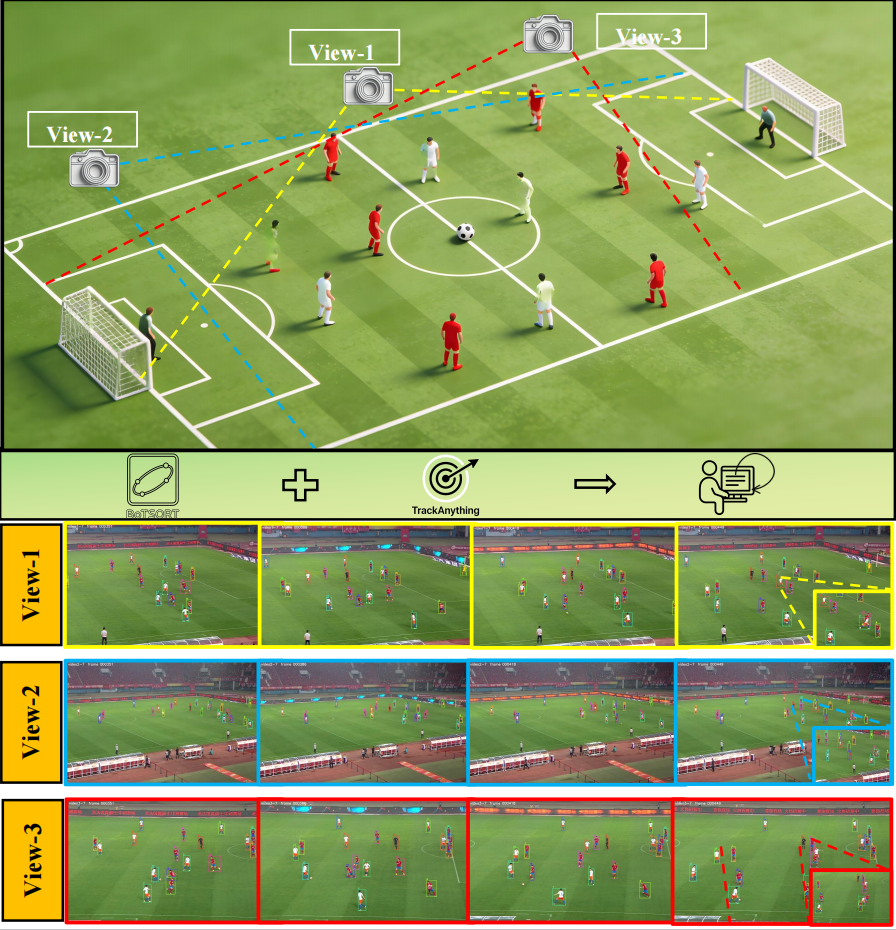

# MvSTrack & MvSTracker
### Multi-view Multi-Object Tracking in Soccer Scenes

---

## 📌 Abstract

Multi-object tracking (MOT) in soccer scenes presents significant challenges due to rapid player dynamics,
frequent occlusions, and dynamic camera motion, which severely degrade single-view tracking performance.
To address these limitations, we introduce **MvSTrack**, a large-scale multi-view MOT benchmark dataset
specifically designed for soccer scenarios.

MvSTrack comprises **72 sequences** from two professional Chinese Super League matches, captured by
**three temporally synchronized cameras**, with **63,693 frames** and **1,042,877 meticulously annotated
bounding boxes**, providing a realistic testbed for complex soccer dynamics including high-velocity motion,
uniform team appearances, and dynamic camera motion.

Furthermore, we propose **MvSTracker**, a novel multi-view tracking framework that exploits
**Bird’s-Eye View (BEV)-derived spatial topology** and a **cascaded matching strategy** to achieve robust
intra-view and inter-view association. By integrating geometric spatial constraints as complementary cues
to appearance features, MvSTracker effectively mitigates identity switches caused by appearance ambiguity
and motion blur.

Extensive experiments on **MvSTrack** demonstrate that our method achieves **state-of-the-art performance**
against both single-view and multi-view baselines, establishing a valuable benchmark and framework for

  
  

## ⚙️ Installation

The code will be uploaded soon.
